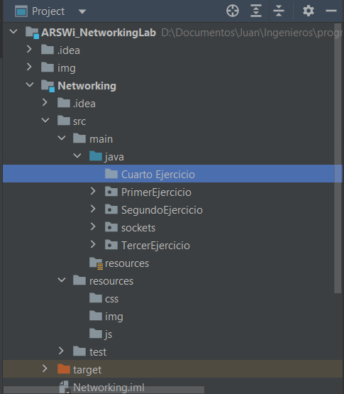
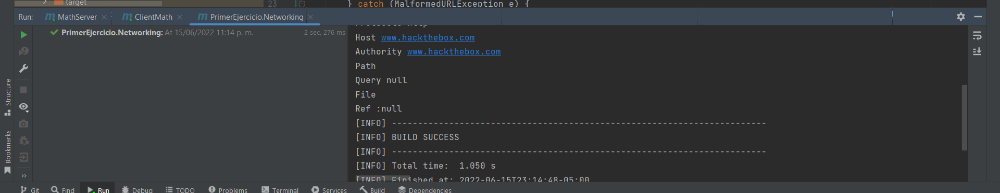
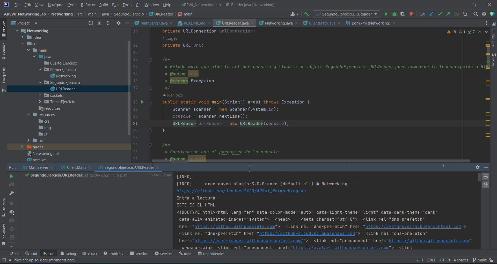
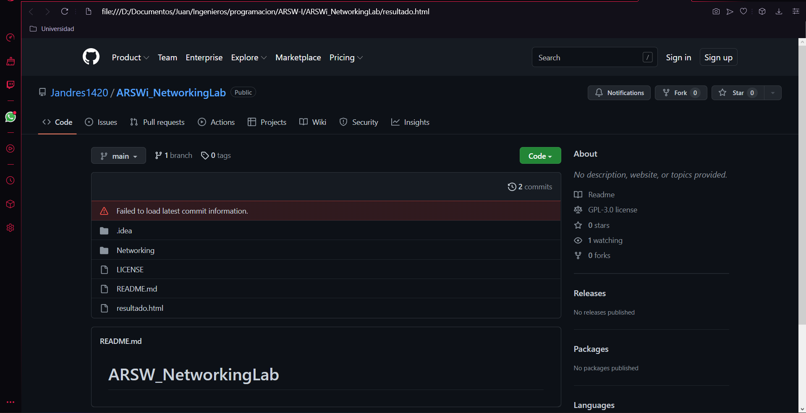
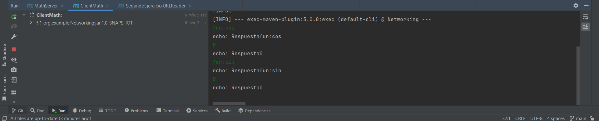
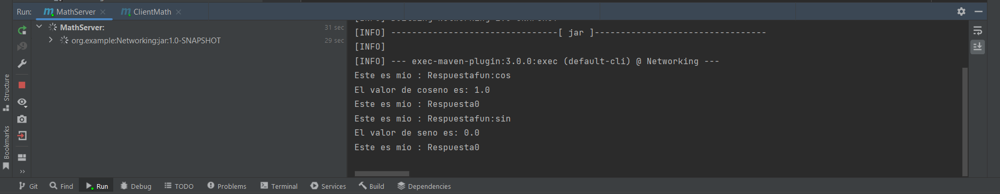
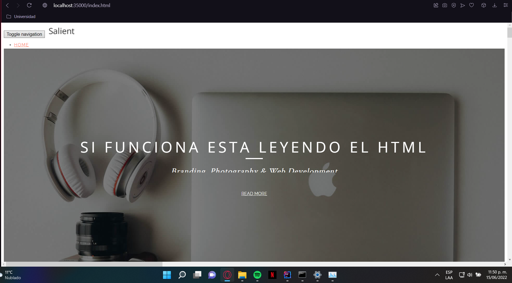

# ARSW NetworkingLab
## Author
**Brayan Camilo Castiblanco**
## Fecha
**25/06/23**
## Introducción
En ente laboratorio se busca hacer un código que nos ayuda a entender la relacion entre cliente servidor

Dependiendo del ejercicio esta organizado en las distintas carpetas
## Primer ejercicio

Escriba un programa en el cual usted cree un objeto URL e imprima en
pantalla cada uno de los datos que retornan los 8 m´etodos de la secci´on anterior.

## Segundo ejercicio
Escriba una aplicacion browser que pregunte una direcci´on URL al usuario
y que lea datos de esa direcci´on y que los almacene en un archivo con el nombre
resultado.html.
Luego intente ver este archivo en el navegador.

Se probo con el link de este repositorio y dio como resultado este html

## Tercer ejercicio
Escriba un servidor que pueda recibir un numero y responda con un operacion sobre este numero. Este servidor puede recibir un mensaje que empiece por
“fun:”, si recibe este mensaje cambia la operacion a las especificada. El servidor
debe responder las funciones seno, coseno y tangente. Por defecto debe empezar
calculando el coseno. Por ejemplo, si el primer n´umero que recibe es 0, debe
responder 1, si despues recibe π/2 debe responder 0, si luego recibe “fun:sin”
debe cambiar la operacion actual a seno, es decir a a partir de ese momento
debe calcular senos. Si enseguida recibe 0 debe responder 0.

Se ejecuto el cliente y se le ingreso los parametros correspondientes y se reviso el output en el servidor

## Ultimo punto
Se demuestra que funciona.

Y tambien con imagenes.

## LOC/h.
+ Entendimiento del problema: **1 Hora**
+ Diseño del problema: **40 minutos**
+ Programación: *6 horas**

